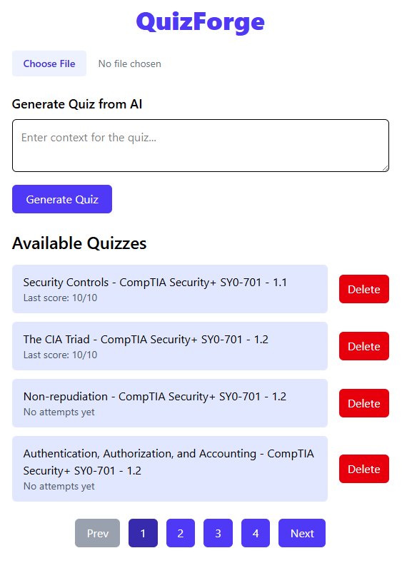

# 🧠 QuizForge

**QuizForge** is a very simple lightweight web-based application that allows users to upload, take, and manage multiple-choice quizzes. It supports JSON-based quiz uploads, automatic scoring, and question-by-question navigation with immediate results.

> ⚠️ **Note**: Not production/hosted. Simple tool I made to help myself study for certification exams.

---

## ✨ Features

- 📤 Upload custom quizzes in JSON format.
- 📚 View a list of all uploaded quizzes.
- 📝 Take quizzes with a multiple-choice interface.
- ✅ Get immediate scoring feedback upon completion.
- 🗑️ Delete quizzes from the list.

---

## 🚀 Tech Stack

### 🧠 Backend

- **FastAPI** — modern and high-performance Python web framework  
- **Sqlite** - lightweight file based database 

### 💻 Frontend

- **React.js** — modern UI with reactive state updates
- **Tailwind CSS** — utility-first styling
- **Axios** - promise-based HTTP client

---

_**(LLM prompt included in misc folder.)**_

**Example json output from LLM:**

```json
{
  "name": "Sample Quiz",
  "description": "A simple quiz example.",
  "questions": [
    {
      "type": "MultipleChoice",
      "question": "What is 2 + 2?",
      "correctAnswer": "4",
      "multiChoiceOptions": ["3", "4", "5", "6"]
    }
  ]
}
```

---

## 📸 Screenshots

A preview of the app in action:




---


---


  

